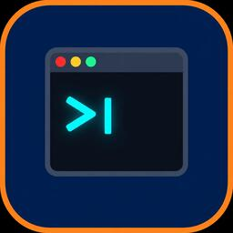

# claude-code-switch

Nintendo Switch homebrew client for Claude — a terminal-style chat UI that
talks to the [Anthropic Messages API](https://docs.anthropic.com/en/api/messages)
from a hacked Switch, built with devkitPro/libnx. Produces a `.nro` that runs
under Atmosphère custom firmware.

This is a **first pass**: a working single-shot-per-turn chat client with the
plumbing in place (TLS, conversation state, scrollback, keyboard input, SD-card
settings). It is not the full Claude Code agentic tool loop — see
[Implemented vs. stubbed](#implemented-vs-stubbed).



## Implemented vs. stubbed

### Implemented

- **Terminal UI** on the libnx console framebuffer: 80×45 text grid, status
  bar, compose line, hint bar, color-coded transcript (user / assistant /
  system / error).
- **Scrollback**: 512-line wrapped transcript buffer; D-pad/stick scrolls a
  line at a time, L/R (or ZL/ZR) page up/down, auto-pins to bottom on new
  output.
- **On-screen keyboard**: `A` opens the Switch `swkbd` software keyboard
  applet to compose a message; the draft is preserved if a request is still
  in flight.
- **USB keyboard input**: `hidGetKeyboardStates` polling (HOS 9.0.0+ USB HID
  keyboard support) — type directly into the compose line, Enter sends,
  Backspace edits, Esc cancels an in-flight request. US layout with Shift.
- **HTTPS networking**: BSD sockets + libcurl + mbedTLS via devkitPro
  portlibs. TLS certificates are verified against a Mozilla CA bundle baked
  into the NRO's RomFS (`romfs/cacert.pem`) — no verification bypass.
- **Anthropic API integration**: `POST {base_url}/v1/messages` with
  `x-api-key` + `anthropic-version: 2023-06-01`, JSON built/parsed with
  cJSON. Multi-turn context: the whole conversation is resent each request
  (as the API requires).
- **Non-blocking requests**: the curl call runs on a worker thread; the UI
  stays responsive with a spinner, and `B`/Esc cancels via the curl progress
  callback.
- **Settings screen** (`-` button): API key (masked display), model name,
  and base URL, persisted as JSON to
  `sdmc:/config/claude-code-switch/settings.json`.
- **Build**: standard devkitPro Makefile → `claude-code-switch.nro`, plus a
  GitHub Actions job that builds it inside the `devkitpro/devkita64` container
  and uploads the `.nro` as an artifact.

### Stubbed / not implemented

- **Claude Code agent loop / tool use**: the real Claude Code runs a
  read-eval tool-use loop (file ops, shell, etc.). This client exposes **no
  tools** — it sends a plain conversation, so the model can only answer with
  text. Tool calling is the obvious next milestone.
- **Streaming (SSE)**: requests use `"stream": false`; the reply appears only
  when complete. SSE parsing via the curl write callback is straightforward
  to add.
- **Bluetooth keyboards**: HOS does not expose generic Bluetooth HID
  keyboards to homebrew; only USB HID keyboards (via `hid`) are read.
  Bluetooth pairing is handled by the OS for Nintendo's own accessories.
- **Input method niceties**: no cursor movement/editing mid-line on USB
  keyboard (append/backspace only), no key repeat, no non-US layouts, no
  touch input.
- **Conversation persistence**: chat history lives in RAM only; clearing (X)
  or quitting loses it. The settings file is the only persisted state.
- **Proxy/custom auth**: `base_url` is configurable, which covers simple
  API-compatible gateways, but there is no OAuth, no custom-header support,
  no `anthropic-beta` flags.

## API key security — read before use

- The key is stored **in plaintext** at
  `sdmc:/config/claude-code-switch/settings.json`. Anything that can read
  the SD card (any homebrew, a PC, another console) can read the key.
- The key travels to `base_url` **only** — it is never sent anywhere else,
  and the code logs nothing. TLS is verified, so it is not sniffable on the
  wire to api.anthropic.com.
- **Recommendation**: create a dedicated Anthropic API key for this app,
  set a hard spend limit on it, and revoke it when done. Do **not** point
  this at untrusted `base_url`s — that would hand your key to a third party.
- If the SD card is shared/lost, rotate the key.

## Controls

| Input | Action |
|---|---|
| `A` | Open software keyboard, compose + send message |
| USB keyboard | Type into compose line; Enter sends |
| D-pad / sticks | Scroll transcript one line |
| `L`/`R`, `ZL`/`ZR` | Page up / page down |
| `B` / Esc | Cancel in-flight request |
| `X` | Clear conversation |
| `-` | Settings screen |
| `+` | Quit |

## Installing / running

Requires a Switch running Atmosphère (any recent version; tested target is
HOS 9.0.0+ for USB keyboard support — the app itself runs on older firmware
but USB keyboard input won't appear).

1. Copy `claude-code-switch.nro` to `sdmc:/switch/claude-code-switch/`.
2. Launch via the Homebrew Menu (hbmenu) — full RAM mode recommended
   (hold `R` on a game, not applet/album mode, so curl + history have heap).
3. Open Settings (`-`), enter your Anthropic API key, save.
4. Back on the chat screen, press `A`, type a message, send.

Networking requires the console to be online; the app performs real DNS +
TLS to `api.anthropic.com` (or your configured `base_url`).

## Building

Toolchain: **devkitA64 + libnx** (devkitPro). The only non-libnx libs used
are devkitPro portlibs already present in the `devkitpro/devkita64` image:
`curl`, `mbedtls`, `zlib`.

### Docker (recommended, matches CI)

```sh
docker run --rm -v "$PWD:/work" -w /work devkitpro/devkita64 make -j"$(nproc)"
```

### Native devkitPro install

```sh
# https://devkitpro.org/wiki/Getting_Started — install devkitA64 + switch-dev
sudo dkp-pacman -S switch-dev switch-curl
export DEVKITPRO=/opt/devkitpro
make -j"$(nproc)"
```

Output: `claude-code-switch.nro` in the repo root. `make clean` resets.

CI: `.github/workflows/build.yml` builds the same Docker command on every
push and publishes the `.nro` as a build artifact.

## Hardware verification status

**Not verified on real hardware.** The `.nro` compiles and links cleanly
with warnings addressed, but it has not been launched on a physical Switch
under Atmosphère, and the Anthropic request path has not been exercised
from a console. Known-risk areas to check on first hardware run:

- `swkbd` overlay behavior while the console framebuffer app is running.
- USB keyboard detection timing (`hidGetKeyboardStates` first-frame deltas).
- TLS handshake latency / CN+SAN handling via the Switch mbedTLS port.
- Heap pressure from multi-MB API responses (capped at 4 MB) in applet
  mode — use full-RAM (title takeover) launch as noted above.

Emulator status: Ryujinx/yuzu do not emulate `hid` USB keyboards or real
network DNS faithfully for homebrew; they were not used.

## Layout

```
source/main.c      app loop, chat + settings screens
source/term.c      line-buffered transcript + console renderer
source/net.c       curl worker thread, request/response, conversation store
source/kbd.c       swkbd wrapper + USB HID keyboard polling
source/settings.c  SD-card settings JSON
source/cJSON.c     vendored cJSON v1.7.18 (MIT)
romfs/cacert.pem   Mozilla CA bundle (TLS verification)
Makefile           devkitPro/libnx .nro build
```

## License / attribution

- cJSON © Dave Gamble, MIT (vendored in `source/cJSON.c`, `include/cJSON.h`).
- Mozilla CA bundle © Mozilla, MPL-2.0 (`romfs/cacert.pem`).
- Everything else: MIT. Homebrew for interoperability; not affiliated with
  Anthropic or Nintendo.
