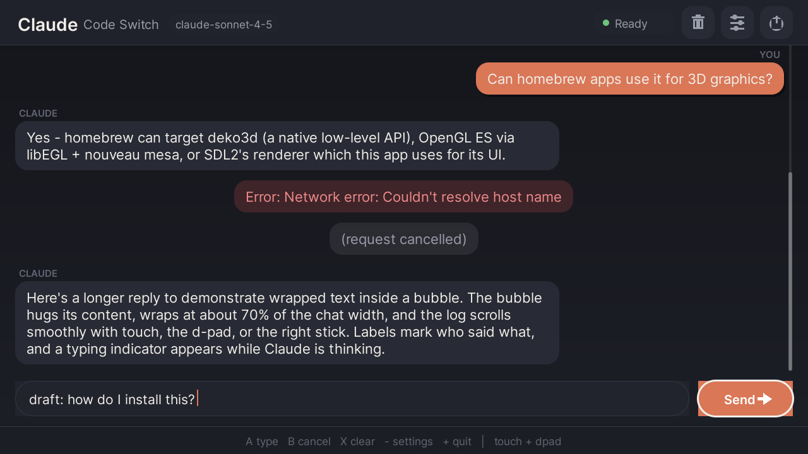
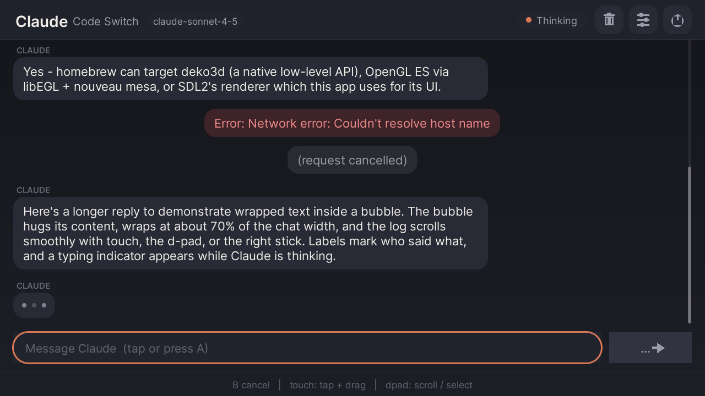
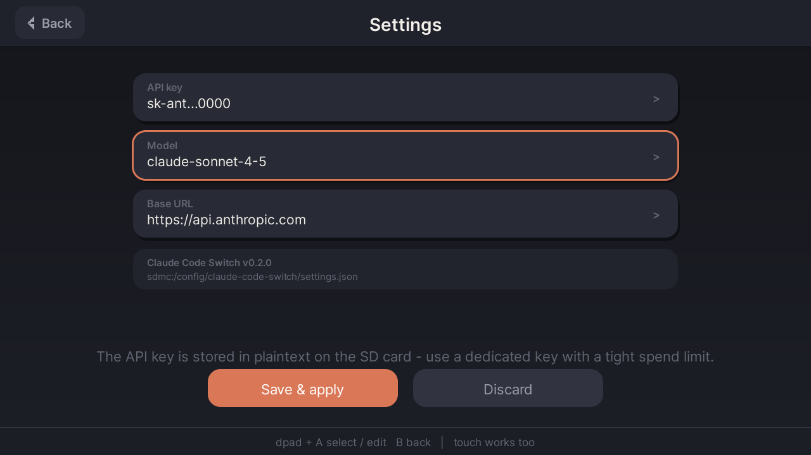
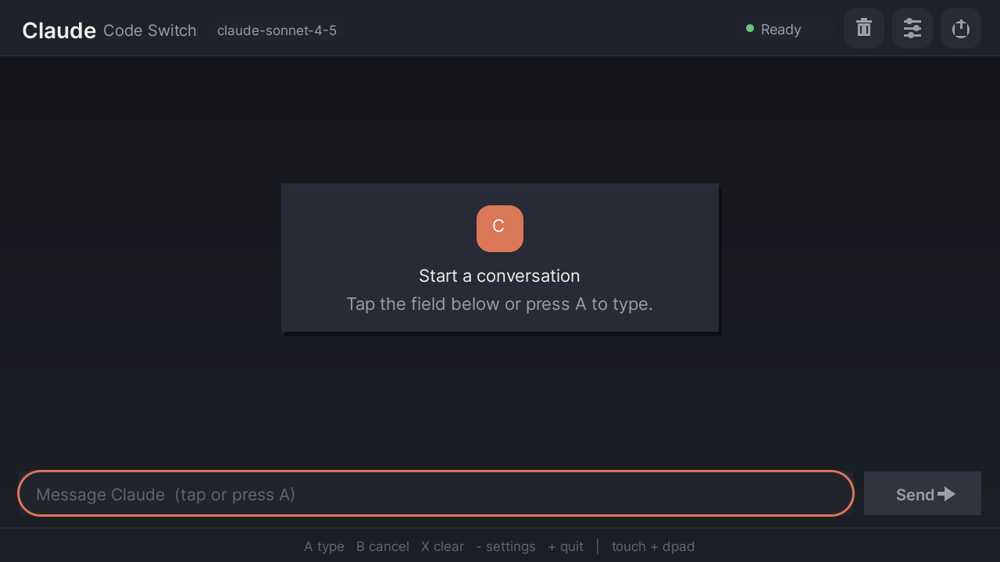

# claude-code-switch

Nintendo Switch homebrew client for Claude — a chat app that talks to the
[Anthropic Messages API](https://docs.anthropic.com/en/api/messages) from a
hacked Switch, built with devkitPro/libnx. Produces a `.nro` that runs under
Atmosphère custom firmware.

**v0.2.0** replaces the v0.1.x plain-terminal UI with a modern, touch-first
graphical interface in the style of the Homebrew Menu: chat bubbles, card
layout, big touch targets, inertial scrolling, and a header/status bar —
with full d-pad/stick/button navigation alongside touch. Rendering is SDL2 +
SDL2_ttf (devkitPro portlibs) compositing into a software surface; the system
`swkbd` applet is used for text entry (native touch keyboard), and USB HID
keyboards still work.

This is a **chat client**: a working single-shot-per-turn client with the
plumbing in place (TLS, conversation state, scrollback, keyboard input, SD-card
settings). It is not the full Claude Code agentic tool loop — see
[Implemented vs. stubbed](#implemented-vs-stubbed).


## Screenshots

These were rendered by the app's own UI code (`source/gfx.c` + `source/ui.c`)
built against desktop SDL2 via `tools/hostshot` — they are pixel-accurate to
the drawing code, but not photographs of real hardware.

| Chat | Thinking | Settings | Empty state |
|---|---|---|---|
|  |  |  |  |

## Implemented vs. stubbed

### Implemented

- **Graphical chat UI** (SDL2 + SDL2_ttf, Inter font, 1280×720+):
  rounded-corner chat bubbles (user right/accent, assistant left/card,
  system + error chips centered), per-sender labels, typing indicator,
  header bar with title + model chip + live status pill, icon buttons,
  compose bar with draft field + Send button, hint strip, toast notices,
  and an empty-state onboarding card.
- **Touch input**: tap to activate (fields, buttons, settings rows),
  drag to scroll the transcript with inertial flick, "jump to latest"
  chip when scrolled up. All targets are ≥ 52 px.
- **D-pad / stick / button navigation**: d-pad left/right moves a focus
  ring across interactive elements (input field, Send, clear, settings,
  quit); A activates; d-pad up/down or either stick scrolls; L/R (or
  ZL/ZR) page up/down. Same model on the settings screen (rows + buttons).
- **On-screen keyboard**: `swkbd` (the HOS system keyboard) is used for the
  compose field and every settings field — the native, touch-capable
  keyboard the OS provides.
- **USB keyboard input**: `hidGetKeyboardStates` polling (HOS 9.0.0+ USB
  HID keyboard support) — type directly into the compose field, Enter
  sends, Backspace edits, Esc cancels an in-flight request. US layout with
  Shift.
- **HTTPS networking**: BSD sockets + libcurl + mbedTLS via devkitPro
  portlibs. TLS certificates are verified against a Mozilla CA bundle baked
  into the NRO's RomFS (`romfs/cacert.pem`) — no verification bypass.
- **Anthropic API integration**: `POST {base_url}/v1/messages` with
  `x-api-key` + `anthropic-version: 2023-06-01`, JSON built/parsed with
  cJSON. Multi-turn context: the whole conversation is resent each request
  (as the API requires).
- **Non-blocking requests**: the curl call runs on a worker thread; the UI
  stays responsive with a typing indicator, and `B`/Esc cancels via the
  curl progress callback.
- **Settings screen**: card list for API key (masked display), model name,
  and base URL, persisted as JSON to
  `sdmc:/config/claude-code-switch/settings.json`.
- **Build**: standard devkitPro Makefile → `claude-code-switch.nro`, plus a
  GitHub Actions job that builds it inside the `devkitpro/devkita64`
  container, uploads the `.nro` as an artifact, and creates a GitHub
  Release with the `.nro` attached on `v*` tags.

### Stubbed / not implemented

- **Claude Code agent loop / tool use**: the real Claude Code runs a
  read-eval tool-use loop (file ops, shell, etc.). This client exposes **no
  tools** — it sends a plain conversation, so the model can only answer
  with text. Tool calling is the obvious next milestone.
- **Streaming (SSE)**: requests use `"stream": false`; the reply appears
  only when complete. SSE parsing via the curl write callback is
  straightforward to add.
- **Bluetooth keyboards**: HOS does not expose generic Bluetooth HID
  keyboards to homebrew; only USB HID keyboards (via `hid`) are read.
- **Input method niceties**: no mid-line cursor movement on USB keyboard
  (append/backspace only), no key repeat, no non-US layouts.
- **Conversation persistence**: chat history lives in RAM only; clearing
  (X/trash) or quitting loses it. The settings file is the only persisted
  state.
- **Proxy/custom auth**: `base_url` is configurable, which covers simple
  API-compatible gateways, but there is no OAuth, no custom-header support,
  no `anthropic-beta` flags.
- **Markdown/code rendering**: replies render as plain wrapped text; code
  blocks are not syntax-highlighted.

## API key security — read before use

- The key is stored **in plaintext** at
  `sdmc:/config/claude-code-switch/settings.json`. Anything that can read
  the SD card (any homebrew, a PC, another console) can read the key.
- The key travels to `base_url` **only** — it is never sent anywhere else,
  and the code logs nothing. TLS is verified, so it is not sniffable on
  the wire to api.anthropic.com.
- **Recommendation**: create a dedicated Anthropic API key for this app,
  set a hard spend limit on it, and revoke it when done. Do **not** point
  this at untrusted `base_url`s — that would hand your key to a third
  party.
- If the SD card is shared/lost, rotate the key.

## Controls

| Input | Action |
|---|---|
| Touch: tap | Activate buttons/fields; tap compose field to open the keyboard |
| Touch: drag | Scroll the transcript (with inertia) |
| `A` | Activate focused element (keyboard on the compose field) |
| `B` / Esc | Cancel in-flight request / back |
| `X` / trash icon | Clear conversation |
| `-` / sliders icon | Settings screen |
| `+` / power icon | Quit |
| D-pad ↑/↓ | Scroll transcript one step |
| D-pad ←/→ | Move focus between interactive elements |
| Either stick | Smooth-scroll transcript |
| `L`/`R`, `ZL`/`ZR` | Page up / page down |
| USB keyboard | Type into compose field; Enter sends |

## Installing / running

Requires a Switch running Atmosphère (any recent version; tested target is
HOS 9.0.0+ for USB keyboard support — the app itself runs on older firmware
but USB keyboard input won't appear).

1. Grab `claude-code-switch.nro` from
   [Releases](https://github.com/CommunityPokeOrg/claude-code-switch/releases)
   and copy it to `sdmc:/switch/claude-code-switch/`.
2. Launch via the Homebrew Menu (hbmenu) — full RAM mode recommended
   (hold `R` on a game, not applet/album mode, so curl + history have
   heap).
3. Open Settings (`-` or the sliders icon), enter your Anthropic API key,
   Save & apply.
4. Tap the compose field (or press `A`), type a message, send.

Networking requires the console to be online; the app performs real DNS +
TLS to `api.anthropic.com` (or your configured `base_url`).

## Building

Toolchain: **devkitA64 + libnx** (devkitPro). All non-libnx libs ship in
the `devkitpro/devkita64` image: `curl`, `mbedtls`, `zlib`, `SDL2`,
`SDL2_ttf` (+ `freetype`, `harfbuzz`, `libpng`, `bzip2`, `EGL`, `GLESv2`,
`drm_nouveau`).

### Docker (recommended, matches CI)

```sh
docker run --rm -v "$PWD:/work" -w /work devkitpro/devkita64 make -j"$(nproc)"
```

### Native devkitPro install

```sh
# https://devkitpro.org/wiki/Getting_Started — install devkitA64 + switch-dev
sudo dkp-pacman -S switch-dev switch-curl switch-sdl2 switch-sdl2_ttf
export DEVKITPRO=/opt/devkitpro
make -j"$(nproc)"
```

Output: `claude-code-switch.nro` in the repo root. `make clean` resets.

CI: `.github/workflows/build.yml` builds the same Docker command on every
push, publishes the `.nro` as a build artifact, and creates a GitHub
Release with the `.nro` attached on `v*` tags.

### Screenshot harness (desktop)

`tools/hostshot/` builds `gfx.c` + `ui.c` against desktop SDL2 and saves
the frames under `docs/` — used for the screenshots above. Requires
`libsdl2-dev libsdl2-ttf-dev libsdl2-image-dev`:

```sh
./tools/hostshot/build.sh docs
```

## Hardware verification status

**Not verified on real hardware.** The `.nro` compiles and links cleanly
with warnings addressed, and the screenshots above prove the actual
drawing/layout code, but the app has not been launched on a physical
Switch under Atmosphère, and the Anthropic request path has not been
exercised from a console. Known-risk areas to check on first hardware run:

- SDL2 video init (`SDL_CreateWindow`/`SDL_CreateRenderer`) under hbmenu —
  falls back to the software renderer if the accelerated one fails.
- `swkbd` overlay compositing over the SDL surface.
- libnx touch coordinate space vs. the SDL window size (clamped; should be
  1:1 at 1280×720 handheld and 1920×1080 docked).
- USB keyboard detection timing (`hidGetKeyboardStates` first-frame
  deltas).
- TLS handshake latency / CN+SAN handling via the Switch mbedTLS port.
- Software composition + texture upload cost per frame in applet mode —
  use full-RAM (title takeover) launch as noted above.

Emulator status: Ryujinx/yuzu do not emulate `hid` USB keyboards, real
touch events, or real network DNS faithfully for homebrew; they were not
used.

## Layout

```
source/main.c      app loop, input plumbing (pad/touch/USB kbd), dispatch
source/gfx.c       SDL2 drawing layer: surface compose, AA rounded rects,
                   gradients, text via SDL_ttf, clipping
source/ui.c        chat + settings screens: bubbles, focus nav, touch,
                   inertial scroll, toasts, typing indicator
source/net.c       curl worker thread, request/response, conversation store
source/kbd.c       swkbd wrapper + USB HID keyboard polling
source/settings.c  SD-card settings JSON
source/cJSON.c     vendored cJSON v1.7.18 (MIT)
romfs/             Inter fonts (OFL) + Mozilla CA bundle (TLS verify)
tools/hostshot/    desktop SDL2 screenshot harness (not part of the .nro)
Makefile           devkitPro/libnx .nro build
```

## License / attribution

- cJSON © Dave Gamble, MIT (vendored in `source/cJSON.c`, `include/cJSON.h`).
- Mozilla CA bundle © Mozilla, MPL-2.0 (`romfs/cacert.pem`).
- Inter font © The Inter Project Authors, SIL OFL 1.1
  (`romfs/Inter-*.ttf`, license in `licenses/Inter-LICENSE.txt`).
- Everything else: MIT. Homebrew for interoperability; not affiliated with
  Anthropic or Nintendo.
